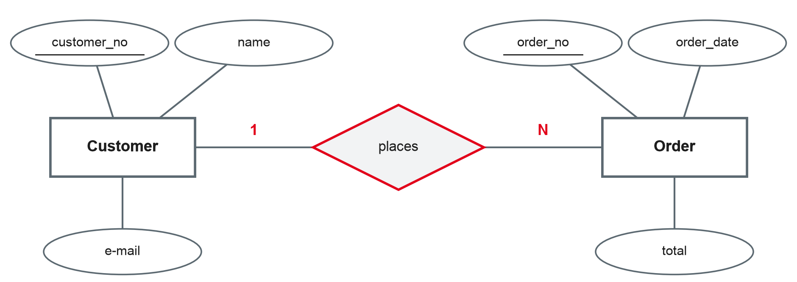
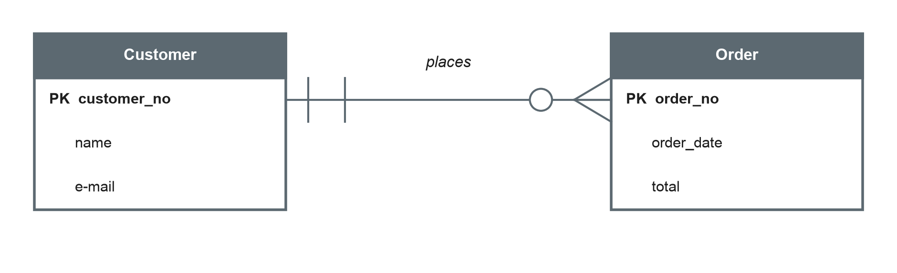
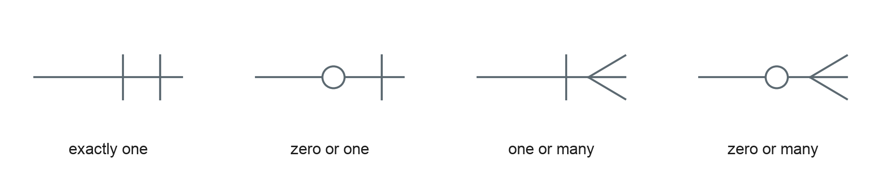

# Semantic Data Modelling I: The ER Model {.title}

::: notes
Time plan for today (3 h): recap and preparation task 15 min · why we model 15 min · entities and attributes 25 min · break 10 min · relationships and cardinalities 35 min · notations 20 min · modelling exercise 50 min · wrap-up 5 min · ~5 min buffer.
The exercise is the core of the session. If the input runs long, move the optional slides to self-study — never shorten the exercise below 40 minutes.
:::

---

# Today's Agenda

1. Recap: your small business from the preparation task
2. Why we model data before we build databases
3. Entities and attributes
4. Relationships and cardinalities
5. Two notations: Chen and crow's foot
6. Exercise: model a bike shop on paper

::: notes
Time and format guide (not shown to students):
0:00 Recap of preparation task (plenary, collect on whiteboard) · 0:15 Why model (input + discussion) · 0:30 Entities and attributes (input) · 0:55 Break · 1:05 Relationships and cardinalities (input + mini exercise) · 1:40 Notations (input) · 2:00 Modelling exercise (groups of 3) · 2:50 Wrap-up.
Bring paper (A3 if possible) and pens for the exercise; modelling tools come later.
:::

---

# Recap: Which "Things" Does Your Business Need?

- Which **things** did you list for your sports club, café or bike shop?
- Which **facts** about them would you store?
- How are the things **connected**?

::: notes
Collect 2–3 examples on the whiteboard as three columns: things (→ entities), facts (→ attributes), connections (→ relationships). Do not use the technical terms yet; reveal them on the following slides and point back to the whiteboard.
:::

---

# Why We Model Data {.section}

From the real world to a database

---

# Three Levels of Data Models

::: layers
- Conceptual model: What does the business need to store? Independent of any technology — e.g. an ER model
- Logical model: How is it structured in a type of database? — e.g. tables of a relational database (session 5)
- Physical model: How is it stored in a specific product? — e.g. data types, indexes in SQLite (session 7)
:::

::: source
Own illustration based on Elmasri and Navathe (2016) and Staud (2005).
:::

::: notes
Read top-down: we move from the business view to the technical view. Today and in session 4 we stay at the conceptual level. The ANSI/SPARC three-schema architecture is a related but different idea (external, conceptual, internal schema); do not mix them up — mention only if students know it.
:::

---

# Why Model Before Building?

- **Communication:** a diagram is a shared language between business experts and IT
- **Completeness:** gaps and contradictions become visible before anything is built
- **Cost:** changing a drawing is cheap; changing a running database with data is expensive
- **Documentation:** the model explains the meaning of the data later — metadata (session 2)

::: callout
A data model is a **simplified picture of a part of the real world** — the part the business needs to store data about.
:::

::: source
Own summary based on Staud (2005) and Elmasri and Navathe (2016).
:::

::: notes
Ask: who has seen a database in their company where nobody knows what a column means? That is the cost of missing models. Link to session 2: the model is business and technical metadata at the same time.
:::

---

# The Entity-Relationship Model

- Proposed by **Peter Chen in 1976** as a "unified view of data"
- Describes the world as **entities** and the **relationships** between them
- Still the most widely taught method for conceptual database design

::: callout
"The entity-relationship model adopts the more natural view that the real world consists of entities and relationships."
:::

::: source
Chen (1976, p. 9).
:::

::: notes
Chen published the model in ACM Transactions on Database Systems. It was designed to be independent of the database type (network, relational, entity set model) — which is why it still works today, also as a starting point for NoSQL designs (session 11). Check the quote and page number against the original before using it in written material.
:::

---

# Entities and Attributes {.section}

The things and their properties

---

# Entities and Entity Types

::: cards
### Entity
A distinguishable "thing" of the real world we want to store data about. Example: the customer *Anna Berger*, the bike with frame number *WAX123*.

### Entity type
The set of all entities with the same properties. Example: *Customer*, *Bike*. Drawn as a **rectangle**.

### Typical candidates
People (customer, employee), objects (product, bike), events (order, repair), concepts (contract, course).
:::

::: source
Based on Chen (1976) and Elmasri and Navathe (2016).
:::

::: notes
In practice "entity" is often used for both the single thing and the type. Students should know the difference for the exam. Tip for finding entity types in a text: look for nouns — but not every noun is an entity type (some are attributes, some are irrelevant).
:::

---

# Attributes

- An **attribute** is a property of an entity type, e.g. *name*, *e-mail*, *date of birth*
- Each attribute has a **domain**: the set of allowed values (e.g. dates, positive numbers)
- Special kinds of attributes:
  - **Composite:** made of parts — *address* = street, postcode, city
  - **Multi-valued:** several values per entity — *phone numbers*
  - **Derived:** calculated from others — *age* from *date of birth*

::: source
Based on Elmasri and Navathe (2016).
:::

::: notes
Derived attributes are usually not stored (they would go out of date). Multi-valued attributes become a separate table in the relational model (session 5) — a first hint at why modelling choices matter.
:::

---

# Keys: Identifying an Entity

- A **key attribute** has a unique value for every entity of the type, e.g. *customer_no*
- A key can consist of **several attributes**, e.g. *flight number + date*
- In diagrams, key attributes are **underlined**

::: callout
Good keys are **unique, stable and never empty**. Names, e-mail addresses or phone numbers are poor keys — they change or repeat.
:::

::: source
Based on Elmasri and Navathe (2016).
:::

::: notes
Ask: is the e-mail address a good key for a customer? (No — customers change addresses, and families share one.) This is why systems usually introduce artificial numbers (surrogate keys). Keys in the relational model — primary, candidate, foreign — follow in session 5.
:::

---

# Relationships and Cardinalities {.section}

How entities are connected

---

# Relationships

- A **relationship type** connects entity types, e.g. *Customer* **places** *Order*
- Drawn as a **diamond** (Chen) and named with a verb
- Relationships can have **attributes** too, e.g. *quantity* in *Order* **contains** *Product*
- The **degree** is the number of entity types involved: usually two (binary)

{width=66%}

::: source
Own illustration based on Chen (1976).
:::

::: notes
Read the diagram in both directions: "a customer places N orders" and "an order is placed by 1 customer". Relationships with three entity types (ternary) exist but are rare and hard to read — they come back in session 4.
:::

---

# Cardinalities

| Type | Meaning | Example |
|---|---|---|
| 1:1 | One entity is related to at most one on the other side | Employee **manages** department |
| 1:N | One entity is related to many on the other side | Customer **places** order |
| M:N | Many entities on both sides | Student **attends** course |

::: callout
To find the cardinality, ask the question **from both sides**: "How many orders can one customer place?" — "How many customers can place one order?"
:::

::: source
Based on Chen (1976) and Elmasri and Navathe (2016).
:::

::: notes
The two-sided question is the most useful habit to teach. Typical mistake: reading the cardinality only from one side. Cardinalities describe the business rules of this company — "employee manages department" may be 1:N in another company with co-heads.
:::

---

# Mandatory or Optional? Participation

- **Minimum cardinality:** must an entity take part in the relationship?
  - Every order **must** have a customer → mandatory (minimum 1)
  - A customer **may** have no order yet → optional (minimum 0)
- **(min, max) notation** writes both numbers at each entity type, e.g. Customer **(0, N)** — Order **(1, 1)**

::: callout
The (min, max) pair is written next to the entity it describes: each **customer** takes part in **0 to N** "places" relationships.
:::

::: source
Based on Elmasri and Navathe (2016) and Staud (2005).
:::

::: notes
Warning for students: the (min, max) notation is written at the other end compared with Chen's 1:N labels. Textbooks differ here, so in the exam always state which notation you use. We use (min, max) as defined on this slide.
:::

---

# Mini Exercise: Find the Cardinality {.exercise}

For each pair, ask from both sides. Which cardinality (1:1, 1:N, M:N) fits — and is participation mandatory or optional?

1. Employee — **works in** — department
2. Bike — **is repaired in** — repair job
3. Product — **is supplied by** — supplier
4. Customer — **has** — customer card
5. Student — **writes** — exam

::: notes
About 10 min in pairs. Defensible answers (depending on business rules — let students argue): 1 1:N (department has many employees; employee in exactly one department), employee mandatory · 2 1:N (one bike, many repair jobs over time; a repair job is for exactly one bike) · 3 M:N (a product can have several suppliers, a supplier delivers many products) · 4 1:1, card optional for the customer, customer mandatory for the card · 5 M:N; a student may not have written any exam yet. The discussion about "depends on the business rule" is the main learning point.
:::

---

# Notations {.section}

Chen and crow's foot

---

# Crow's-Foot Notation

{width=82%}

{width=70%}

::: source
Own illustration based on Elmasri and Navathe (2016).
:::

::: notes
Read the symbol next to the other entity: "one customer places zero or many orders"; "one order is placed by exactly one customer". The inner symbol (next to the entity box) shows the maximum, the outer symbol the minimum. Crow's foot is common in practice tools (e.g. draw.io, Lucidchart, database IDEs) and puts attributes inside the boxes, which saves space.
:::

---

# Chen vs. Crow's Foot

| | Chen | Crow's foot |
|---|---|---|
| Entity type | Rectangle | Box with attribute list |
| Attribute | Ellipse | Line inside the box |
| Relationship | Diamond with name | Line with name |
| Cardinality | 1, N, M at the lines | Symbols at the line ends |
| Strength | Clear concepts, good for teaching | Compact, close to tables, common in tools |
| Weakness | Large diagrams get crowded | M:N and relationship attributes are less visible |

::: source
Own comparison based on Chen (1976) and Elmasri and Navathe (2016).
:::

::: notes
In this module: Chen for concepts (exam), crow's foot for the design project (tools). Both express the same content. Other notations (UML class diagrams, IDEF1X) exist; UML is covered in other modules.
:::

---

# Modelling Rules of Thumb {.optional}

- Name entity types with **singular nouns** (*Customer*, not *Customers*)
- Name relationships with **verbs** that read well from left to right
- Store each fact **once** — if an attribute appears in two entity types, check the model
- If something has its own attributes and relationships, it is probably an **entity type**, not an attribute
- Model what the business **needs**, not everything that exists

::: source
Own summary based on Staud (2005).
:::

::: notes
Self-study. Example for rule 4: "supplier" as an attribute of product works until the business wants the supplier's address — then it becomes an entity type.
:::

---

# Exercise: Model a Bike Shop {.exercise}

*Velo Neckar* sells and repairs bikes. Draw an ER model in **Chen notation** with attributes, keys and cardinalities.

- Customers are registered with customer number, name, e-mail and address
- The shop sells bikes; each bike has a frame number, brand, model and price. A bike is bought by at most one customer
- Customers bring bikes for repair. A repair job has a number, date, description and cost, and concerns exactly one bike
- Each repair job is done by one or more mechanics; mechanics have an employee number, name and qualification
- Spare parts (part number, name, price) are used in repair jobs, with the quantity used

::: notes
Groups of 3, about 35 min + 15 min presentation of 2–3 models.
Expected solution (several variants are defensible): entity types Customer, Bike, RepairJob, Mechanic, SparePart. Relationships: Customer buys Bike 1:N (bike optional: shop stock not yet sold); Bike is repaired in RepairJob 1:N; Mechanic works on RepairJob M:N; RepairJob uses SparePart M:N with attribute quantity (a relationship attribute!). Discussion points: should customers who only bring bikes for repair (bike not bought here) be linked through a "brings" relationship? Is "address" composite? Is price the price of the bike type or of the single bike?
Keep the models: they are refined in session 4 (weak entities, generalisation: Mechanic as a specialisation of Employee).
:::

---

# Key Takeaways

- Data models move from **conceptual** (what) via **logical** (structure) to **physical** (storage)
- The **ER model** describes the world as entity types, attributes and relationships
- **Keys** identify entities; good keys are unique, stable and never empty
- **Cardinalities** (1:1, 1:N, M:N) and **participation** (mandatory, optional) express business rules — always ask from both sides
- **Chen** and **crow's-foot** notation show the same content in different ways

---

# Next Session: Semantic Data Modelling II

- Weak entity types and identifying relationships
- M:N and recursive relationships
- Generalisation and specialisation
- Typical modelling pitfalls
- **Design project kickoff:** teams, cases and milestones

::: callout
**Preparation:** bring your bike shop model — we will extend it. Think about which business you would like to model in your design project.
:::

---

# References {.references}

- Chen, P. P.-S. (1976). The entity-relationship model—Toward a unified view of data. *ACM Transactions on Database Systems, 1*(1), 9–36. https://doi.org/10.1145/320434.320440
- Elmasri, R., & Navathe, S. B. (2016). *Fundamentals of database systems* (7th ed.). Pearson.
- Staud, J. L. (2005). *Datenmodellierung und Datenbankentwurf: Ein Vergleich aktueller Methoden*. Springer. https://doi.org/10.1007/b137949
