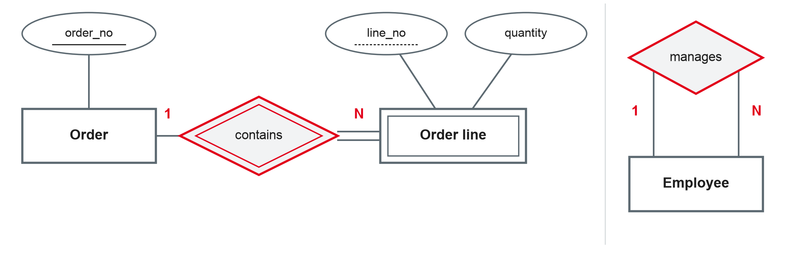
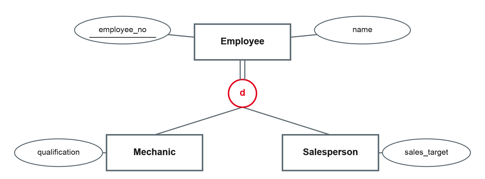

# Semantic Data Modelling II and Project Kickoff {.title}

::: notes
Time plan for today (3 h): recap 10 min · weak entity types 20 min · M:N and recursive relationships 20 min · generalisation and specialisation 25 min · break 10 min · modelling pitfalls 15 min · exercise 35 min · design project kickoff and team formation 40 min · wrap-up 5 min.
The kickoff needs the full 40 minutes, including time for teams to form and pick a case. If the input runs long, move the optional slides to self-study and shorten the exercise.
:::

---

# Today's Agenda

1. Recap: your bike shop models
2. Weak entity types
3. M:N and recursive relationships
4. Generalisation and specialisation
5. Typical modelling pitfalls
6. Exercise: extend the bike shop model
7. Design project kickoff: teams, cases and milestones

::: notes
Time and format guide (not shown to students):
0:00 Recap (plenary, one model on the whiteboard) · 0:10 Weak entities, M:N, recursive (input + mini questions) · 0:50 Generalisation (input) · 1:15 Break · 1:25 Pitfalls (input + discussion) · 1:40 Exercise (same groups as session 3) · 2:15 Project kickoff and team formation · 2:55 Wrap-up.
:::

---

# Recap: Open Questions from the Bike Shop

- How do we model the **lines of a repair job** (parts used, quantity)?
- Mechanics and salespeople are both **employees** — one entity type or two?
- Who **supervises** whom in the workshop?

::: callout
Today's concepts answer exactly these questions.
:::

::: notes
Show one group's model from session 3 (photo or redraw). Collect the open points students noticed themselves. Each question links to one part of today's input: weak entities, specialisation, recursive relationships.
:::

---

# Weak Entity Types {.section}

Entities that depend on others for their identity

---

# Weak Entity Types

- A **weak entity type** has no key of its own; it is identified through an **owner** entity type
- It is linked to the owner by an **identifying relationship**
- Its **partial key** distinguishes entities of the same owner, e.g. *line_no* within one order
- Full identification = owner key + partial key: *order_no 4711, line 2*

{width=74%}

::: source
Own illustration based on Chen (1976) and Elmasri and Navathe (2016).
:::

::: notes
Notation: double rectangle for the weak entity type, double diamond for the identifying relationship, dashed underline for the partial key, double line for total participation (every order line must belong to an order). The right part of the figure (recursive relationship) follows on a later slide. Typical weak entity types: order lines, invoice items, rooms in a building, dependants of an employee.
:::

---

# Weak or Strong? {.exercise}

Should these be modelled as weak entity types? Name the owner and the partial key.

1. A seat in a cinema hall
2. A chapter in a book
3. A customer of a bank
4. An instalment of a loan
5. A product in a catalogue

::: notes
Answers: 1 weak — owner hall, partial key row + seat number · 2 weak — owner book, partial key chapter number · 3 strong — customers have their own number · 4 weak — owner loan, partial key instalment number · 5 strong — products have article numbers. Key test: does the thing make sense, and can it be identified, without its owner?
:::

---

# More Relationship Types {.section}

M:N, recursive and ternary

---

# M:N Relationships with Attributes

- Many-to-many relationships often carry their own **attributes**
  - *Student* **attends** *course* — with *grade*
  - *Repair job* **uses** *spare part* — with *quantity*
- The attribute belongs to the **combination**, not to one side: the quantity is neither a property of the part nor of the repair job

::: callout
If an attribute only makes sense for a **pair** of entities, it belongs to the relationship.
:::

::: source
Based on Elmasri and Navathe (2016).
:::

::: notes
In session 5 we will see that an M:N relationship becomes its own table in the relational model, and its attributes become columns of that table. Ask: where does the price go — to the spare part (list price) or to "uses" (price charged in this repair)? Both can be right, depending on the business rule.
:::

---

# Recursive Relationships

- A **recursive relationship** connects an entity type with **itself**
- Examples: employee **manages** employee · part **consists of** part · course **requires** course
- Each side has a **role name** to make the direction clear: *manager* and *staff member*

::: callout
Read it with the roles: "**one** employee in the role *manager* manages **N** employees in the role *staff member*."
:::

::: source
Based on Elmasri and Navathe (2016).
:::

::: notes
Refer back to the right part of the figure on the weak entity slide. Bill of materials ("part consists of part", M:N with quantity) is a classic example in manufacturing — students from industrial companies will know it from SAP.
:::

---

# Ternary Relationships {.optional}

- A relationship of **degree three** connects three entity types, e.g. *supplier* **supplies** *part* **for** *project*
- It is not always the same as three binary relationships: the ternary says *which* supplier delivers *which* part to *which* project
- Ternary relationships are hard to read and to assign cardinalities — use them only when the business fact really involves all three

::: source
Based on Elmasri and Navathe (2016).
:::

::: notes
Self-study. Good test: can the fact be reconstructed from binary relationships without losing information? If not, the ternary is needed.
:::

---

# Generalisation and Specialisation {.section}

Superclasses and subclasses

---

# Specialisation

{width=72%}

- **Superclass** *Employee* holds the common attributes; **subclasses** add their own
- Subclasses **inherit** all attributes and relationships of the superclass
- **Specialisation** works top-down, **generalisation** bottom-up — the result is the same structure

::: source
Own illustration based on Elmasri and Navathe (2016).
:::

::: notes
This is part of the enhanced ER (EER) model. Generalisation: start from Mechanic and Salesperson, notice common attributes, and introduce Employee. Specialisation: start from Employee and introduce subclasses for groups with extra attributes or relationships (e.g. only mechanics work on repair jobs).
:::

---

# Constraints on Specialisation

| | Meaning | Example |
|---|---|---|
| **Disjoint (d)** | An entity belongs to at most one subclass | An employee is mechanic **or** salesperson |
| **Overlapping (o)** | An entity can belong to several subclasses | A person is student **and** employee of the university |
| **Total** | Every superclass entity belongs to a subclass (double line) | Every employee is mechanic or salesperson |
| **Partial** | Some superclass entities belong to no subclass | Some employees have no special role |

::: source
Based on Elmasri and Navathe (2016).
:::

::: notes
The two constraints combine: disjoint–total, disjoint–partial, overlapping–total, overlapping–partial. In the figure: disjoint (d) and total (double line). Ask: is total right for the bike shop? What about the owner or the apprentice?
:::

---

# Modelling Pitfalls {.section}

What often goes wrong

---

# Five Typical Pitfalls

1. **Attribute or entity?** An attribute that needs its own attributes or relationships should be an entity type (supplier, address with history)
2. **Missing history:** the price at the time of the order is not the current price — store it with the order line
3. **Derived data stored:** age, totals or counts that can be calculated go out of date
4. **Modelling the process, not the data:** "customer calls shop" is an event, not necessarily a relationship to store
5. **Unclear meaning:** relationship names like "has" or "belongs to" hide the business rule

::: source
Own summary based on Staud (2005) and Elmasri and Navathe (2016).
:::

::: notes
Pitfall 2 is the most common in student projects: invoices that change when the product price changes. Ask students to check their bike shop models against the five points during the exercise.
:::

---

# Exercise: Extend the Bike Shop {.exercise}

Extend your model from session 3 (Chen notation):

1. Model the **parts used in a repair job** — as an M:N relationship with attributes or as a weak entity type *repair line*? Justify your choice.
2. Introduce **Employee** as a superclass of *Mechanic* and *Salesperson*. Which constraints apply (disjoint/overlapping, total/partial)?
3. Add that an experienced mechanic **supervises** apprentices.
4. The shop wants to know **which price** a customer paid for each part. Where does this attribute go?
5. Check your model against the **five pitfalls**.

::: notes
Same groups as session 3, about 30 min + short discussion of 2 models.
Expected answers: 1 both are defensible — M:N "uses" with quantity and price_charged, or weak entity RepairLine (owner RepairJob, partial key line_no) related to SparePart; the weak entity is better if one part can appear twice in a job or lines are numbered on the invoice. 2 disjoint, partial (owner/apprentice may be neither) — or total if every employee has one of the roles. 3 recursive 1:N on Mechanic (or Employee) with roles supervisor/apprentice. 4 price_charged on "uses" / RepairLine, not on SparePart (pitfall 2).
:::

---

# Design Project Kickoff {.section}

Your own database, from model to data

---

# The Design Project

- In **teams**, you design and build a small database for a **business case of your choice**
- It runs through the whole module: each technical topic is applied to your case right after it is taught
- The result is a working **SQLite database** with documentation, loaded with real or realistic data

::: callout
The design project is part of the module assessment (combined with the written exam). Details and grading criteria follow in the **project brief**.
:::

::: notes
The weighting between exam and project is not decided yet (STATUS open item) — do not announce numbers until the brief is final. Team size suggestion: 3–4 students. Explain that the project gives them practice for the exam and a portfolio piece for their company.
:::

---

# Milestones

| Milestone | Content | After session |
|---|---|---|
| 1 · ER model | Case description, ER model with attributes, keys and cardinalities | 6 |
| 2 · Relational schema | Mapped and normalised schema | 7 |
| 3 · Database and queries | SQLite database with constraints; business questions answered in SQL | 12 |
| 4 · Data loading and quality | Real or open data cleaned and loaded with Python | 16 |
| 5 · Analytics extension | Star schema for one business process | 17 |
| Final presentation | Design decisions, demo, lessons learned | 20 |

::: notes
Milestones follow the session plan: each milestone applies the topics just taught. Exact deadlines and submission format go into the project brief. Session 12 is a buffer and feedback session — team schemas and SQL are reviewed there.
:::

---

# Choosing a Case

::: cards
### Good cases
Clear business with several related things: a sports club, a coworking space, a food delivery service, a small hotel, a student housing office.

### Your company?
A process you know from your training company — but only **simplified and anonymised**, without confidential data.

### Check your case
At least 6–8 entity types, one M:N relationship, one specialisation, data you can realistically obtain or generate.
:::

::: notes
Discourage cases that are too small (address book) or too large (a whole ERP). Company cases: remind students to ask their supervisor in the company if in doubt; no real customer or employee data in the project.
:::

---

# Team Formation {.exercise}

1. Form teams of **3–4 students**
2. Agree on a **case** and write a short case description (5–8 sentences): what does the business do, which data does it need to store?
3. List the first **entity types** and one **open question** for the next session

::: notes
About 15 min. Collect team names and cases at the end (list or course platform). Check that no two teams pick the same case — or allow it with different focus. The case description is the start of milestone 1.
:::

---

# Key Takeaways

- **Weak entity types** are identified through an owner and a partial key
- **M:N relationships** can carry attributes that belong to the combination of entities
- **Recursive relationships** connect an entity type with itself, using role names
- **Specialisation** creates subclasses that inherit from a superclass; constraints are disjoint/overlapping and total/partial
- Watch the pitfalls: attribute vs. entity, history, derived data, process vs. data, unclear names

---

# Next Session: The Relational Model

- Relations, tuples, attributes and domains
- Keys: primary, candidate and foreign keys
- Integrity constraints
- Mapping an ER model to a relational schema

::: callout
**Preparation:** finish the first version of your team's ER model — we will map it to tables in session 5.
:::

---

# References {.references}

- Chen, P. P.-S. (1976). The entity-relationship model—Toward a unified view of data. *ACM Transactions on Database Systems, 1*(1), 9–36. https://doi.org/10.1145/320434.320440
- Elmasri, R., & Navathe, S. B. (2016). *Fundamentals of database systems* (7th ed.). Pearson.
- Staud, J. L. (2005). *Datenmodellierung und Datenbankentwurf: Ein Vergleich aktueller Methoden*. Springer. https://doi.org/10.1007/b137949
